# Music Classification using Machine Learning Algorithms  
Laroy Milton, Erwin Pascual

## Introduction  
Music is represented through elements such as pitch, rhythm, dynamics, and sound. We can denote these pieces of information through various file formats that make it easy for a computer to comprehend. 

There are two forms of these formats: MIDI format (Musical Digital Interface) which stores the symbolic information of the song, and an AUDIO format (mp3, WAV, etc.) which captures the sound of the actual performance in signal form. Various companies use music classification to either produce song recommendations for their clients (e.g. Spotify’s Music Recommendations) or song identification purposes (e.g. Shazam).

### Problem Definition  
The problem within this project that we are trying to solve is by classifying music based on the composer given the musical features that we used a piano roll as input.

Our project employs a supervised approach using classification. We use the composer's name as labels in our system, which is converted to non-negative integers. For example: 0 - Mozart, 1 - Bach and so on.

### Data  
Our input data will mainly be in the form of MIDI files (Music Digital Interface) which contains the symbolic information of the song. We can view this information as a form of ‘‘digital sheet music” stored within a file. This is better than having AUDIO file formats such as mp3, WAV, etc. because since MIDI does not contain any auditory information its file size is relatively small when compared to an AUDIO file.

We will process such data using the music21 library and use its features to break down the song into its constituent parts. We then saved the processed data and converted to a CSV file for fast and easy retrieval.

### Objectives  
The main aim of this project is to implement models that classify piano music by its composer based on relevant musical features for the era of music (dynamics, pitch variety, key, mood etc.). The other aim of this project is to compare and contrast the accuracy of each model to ensure that the model classifies music by its features correctly.

### Motivation  
The main motivation behind the project is because of our general interest in music. The other factor behind the motivation of the project is the many applications that music classification has. Such examples include: music similarity, music recommendation based on your preferences, and music identification.

### Challenges  
During the presentation of our slides contained an error for Data Set 2. The data set was missing 50 entries for Bach and thus skewed the results. The problem has since been corrected, and this report reflects the final numbers.

## Methods  
### Data  
We got our data from http://www.kunstderfuge.com/  which hosts the largest distribution of .MIDI files from classical composers. To gain access to all their files, we had to pay a hefty fee of €40. Data set 1 consists of 100 piano rolls from each composer; Mozart and Chopin for a total of 200 midi files. Data set 2 consists of 100 piano rolls from each composer; Mozart, Chopin, Beethoven, Debussy, and Bach, for a total of 500 midi files.

### Pre-processing  
Before we could do anything with the MIDI files, first we had to parse each file into a “music21” object using the chosen features list mentioned in section 2.2.2. After parsing, we appended the objects to an array to prepare for feature extraction. We converted the output of the extraction process to a list, then finally to increase the efficiency of data handling, we saved the list as a CSV file to drive.

### Division into test/train/validation  
We divided the data between 80% training 20% test/validation

### Feature Extraction  
These are the features we extract when we process our data, which will be a range of float numbers depending on the feature.
features.native.DiminishedSeventhSimultaneityPrevalence
Percentage of all occurrences that are Diminished Seventh Chords
features.native.DiminishedTriadSimultaneityPrevalence
Percentage of all occurrences that are Diminished Triads (chords) in the song
features.native.DominantSeventhSimultaneityPrevalence
Percentage of all occurrences that are dominant seventh chords in the song
features.native.MajorTriadSimultaneityPrevalence
Percentage of all occurrences that are Major Triads (chords) in the song
features.native.MinorTriadSimultaneityPrevalence
Percentage of all occurrences that are Minor Triads (chords) in the song 
features.native.MostCommonNoteQuarterLength
Most common note length in the song (e.g. Quarter Note - 1.0, Half Note - 2.0, Whole Note - 4.0)
features.native.MostCommonNoteQuarterLengthPrevalence
Percentage of all occurrences  that contain the most common note length
features.native.MostCommonPitchClassSetSimultaneityPrevalence
All pitch classes (e.g. A,B,C,D,E,F,G are all pitch classes [flats and sharps are also included] from all octaves) occurrences that are the most common
features.native.MostCommonSetClassSimultaneityPrevalence
All set classes (set of notes in each simultaneity) occurrences that are the most common
features.native.RangeOfNoteQuarterLengths
Gets the difference between the shortest note length and the longest note length (e.g. Longest note length: 4.0; Shortest note length: 0.5; Difference: 3.5)
features.native.TonalCertainty
Certainty of tone
features.native.TriadSimultaneityPrevalence
Percentage of all occurrences that are diminished triads (chords)
features.native.UniqueNoteQuarterLengths
Note length that is unique in the song
features.native.UniquePitchClassSetSimultaneities
Number of unique pitch class occurrences
features.native.UniqueSetClassSimultaneities
Number of set pitch class occurrences
features.jSymbolic.AmountOfArpeggiationFeature
How much Arpeggiation (The act of spreading a chord out instead of playing it simultaneously) the song has
features.jSymbolic.AverageNoteDurationFeature
Average duration of notes in seconds
features.jSymbolic.VariabilityOfNoteDurationFeature
Takes the Standard Deviation of notes played by each MIDI instrument that is used to play at least one note
features.jSymbolic.MostCommonPitchClassFeature
Bin the label of the most common pitch class 
features.jSymbolic.PitchVarietyFeature
Number of pitches that have been used at least once
features.jSymbolic.BasicPitchHistogramFeature
Feature extractor that bins the frequency of all pitches in the song
features.jSymbolic.FifthsPitchHistogramFeature
Feature extractor that bins the frequency of pitches that are distanced five semitones apart in the song

## Methods Used  
Stochastic Gradient Descent Classifier
In Stochastic Gradient Descent (SGD), we randomly select a few samples randomly for each iteration to find the minima to a convex problem. It is a simple yet effective approach to a linear classifier. Its main advantage is ease of implementation and efficiency; however, it is sensitive to feature scaling. For both data set 1 and data set 2, SGD is definitely underfit, though the training and validation curves converge, but they have a relatively high error. Using a more complex model should help decrease the Mean Squared Error (MSE). Also, the jagged lines show that there may not be enough data points available with only 100 songs per composer. 

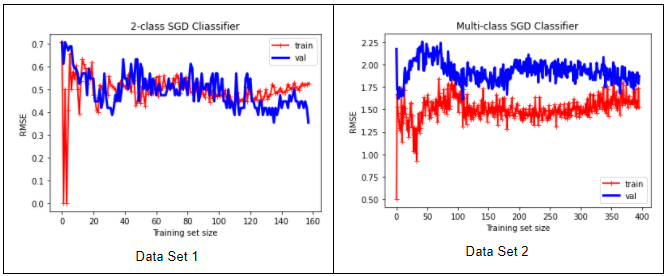  

### Random Forest Classifier  
Random Forest Classifiers use an ensemble of individual decision trees to make a prediction. Each tree outputs a prediction with the class that has the highest votes being the final prediction for the model. It also builds multiple trees by choosing the best features from a randomly selected subset of features. Random Forest Classifiers are also useful for determining the most important features to aid with feature selection. For both data sets, the learning curves indicate a high variance, which means the models are overfit. This means the model could fit very well but does not generalize well. Using the important features should have been a priority to reduce the number of features to be passed into a new model. Introducing regularization would also most likely help in this situation.

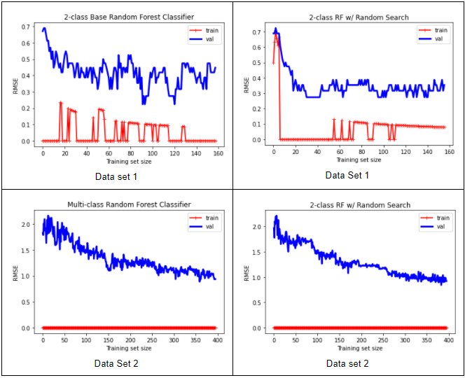  

### Logistic Regression Classifier  
Logistic Regression Classifiers estimate the probability that the input belongs to a specific class with probabilities bounded between 0 and 1. In a 2-class system, a probability greater than 0.5, the predicted outcome would be 1 and less than 0.5 the prediction would be 0. Our Logistic Regression Classifier has an almost ideal learning curve. Given more data, the curves should converge.

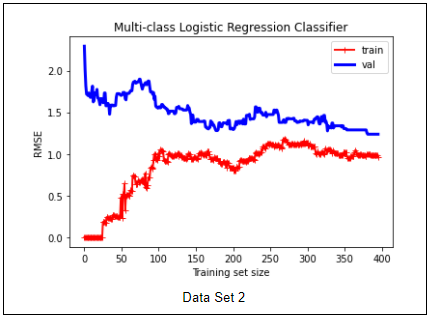  

### Parameter Tuning  
For Random Forest Classifier we used a randomized search grid to find the best parameters. It uses cross-validation to test possible combinations of the hyperparameters. Which outputs the best parameters for use. We then used a grid search around the new parameters to see if further refinement was possible, however the model performed poorly so we stopped using it since grid search is also resource intensive.

### Implementation Details  
For data processing and feature extraction we used the Music21 library. For the stochastic gradient descent classifier we used scikit-learn linear_model.SGDClassifier. For logistic regression we used scikit-learn linear_model.LogisticRegression. For random forest classification, we used ensemble.RandomForestClassifier. Lastly, for hyperparameter tuning on the random forest classifiers, we used model_selection.RandomizedSearchCV, which outputs the best parameters.

## Results  
### Data Set 1 (Mozart, Bach)  
Since our model relies more heavily on recall than precision, the score related to recall is more valuable. The best model based on data is Random Forest with Random Grid Search.

Scores  
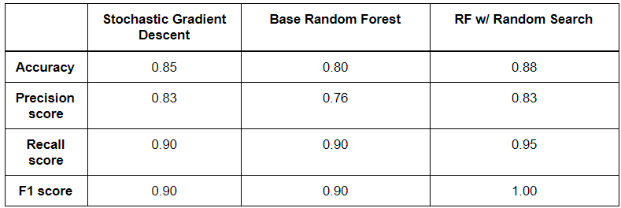  

Confusion Matrix  
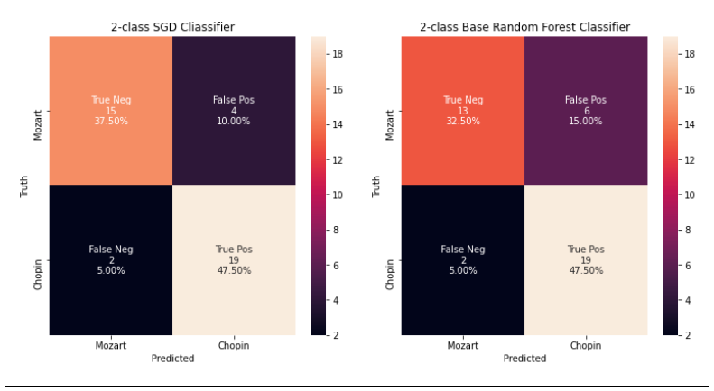  
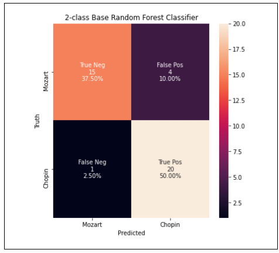

Tchaikovsky’s Nutcracker was classified as:  
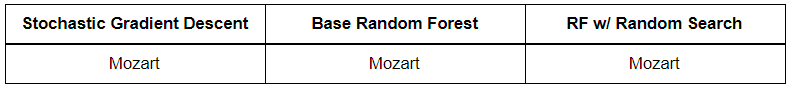  

Feature Importance  
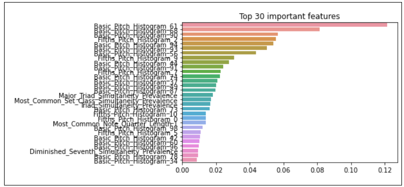

### Data Set 2 (Mozart, Chopin, Beethoven, Debussy, Bach)  
Stochastic Gradient Descent had the worst scores, whereas Random Forest with Random Grid Search had the highest score. The 0.01 difference between the Base Random Forest and the Random Forest with Random Grid Search is negligible considering how resource intensive Random Grid Search is.

Scores  
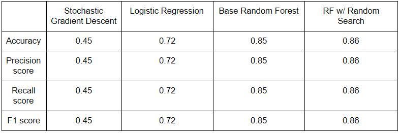

Confusion Matrix  
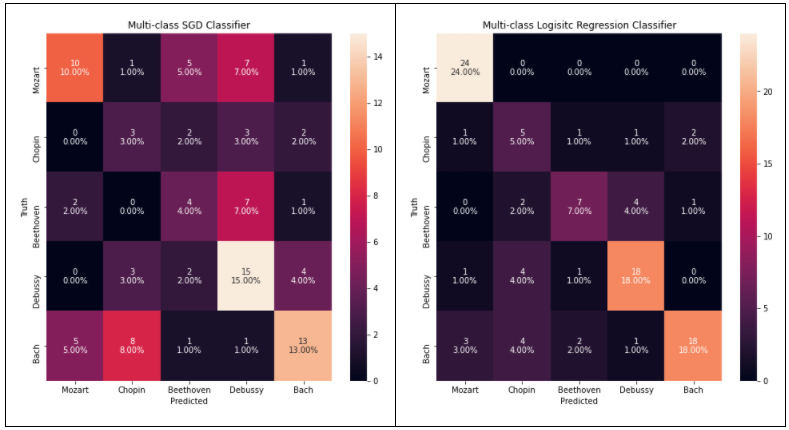  
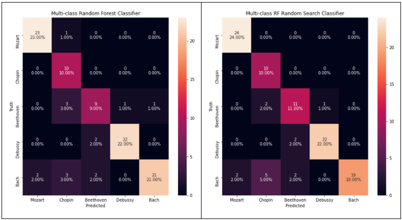  

Tchaikovsky’s Nutcracker was classified as:  
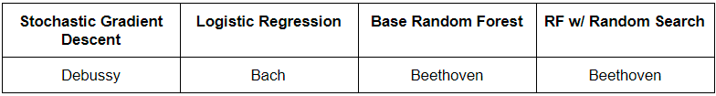 

Feature Importance  
It’s interesting to note the differences between the top 30 important features between data sets.  
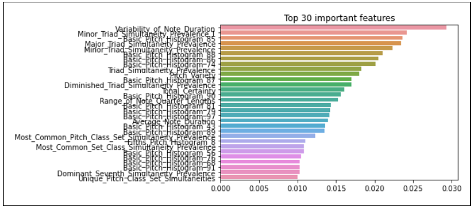

## Discussion and Conclusion  
Starting this project off as a music generating project, it quickly became apparent that the time investment to complete such an undertaking would not fit within our time frame. Since we switched focus to classification, the project became more manageable. Based on the data though, it might have been worthwhile to separate the data between era’s for when the music had been composed. That way we would have had more data points rather than being limited to a specific composer. Using unsupervised methods would also have benefited our project greatly, and it would have been interesting to see the results of how it would cluster the data.

## References  

Cuthbert, Michael Scott, et al. FEATURE EXTRACTION AND MACHINE LEARNING ON SYMBOLIC
MUSIC USING THE music21 TOOLKIT. FEATURE EXTRACTION AND MACHINE LEARNING ON SYMBOLIC MUSIC USING THE music21 TOOLKIT.

Cuthbert, Michael Scott, et al. “music21.Features.jSymbolic.” music21.Features.jSymbolic
music21 Documentation, web.mit.edu/music21/doc/moduleReference/moduleFeaturesJSymbolic.html#music21.features.jSymbolic.AmountOfArpeggiationFeature.

Géron Aurélien, Hands-on machine learning with Scikit-Learn, Keras, and TensorFlow: concepts, tools, and techniques to build intelligent systems. Sebastopol, CA: O'Reilly Media, Inc., 2019. 
